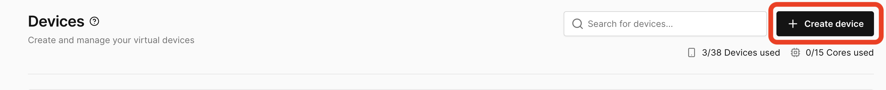
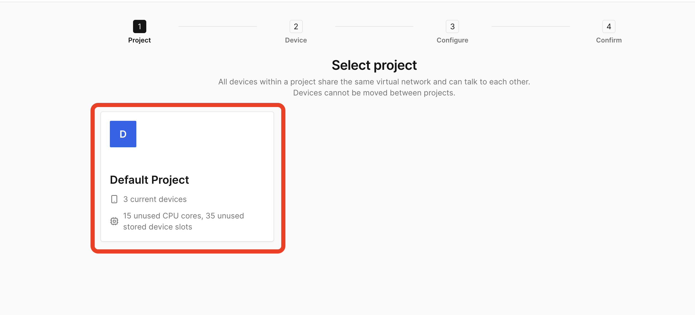
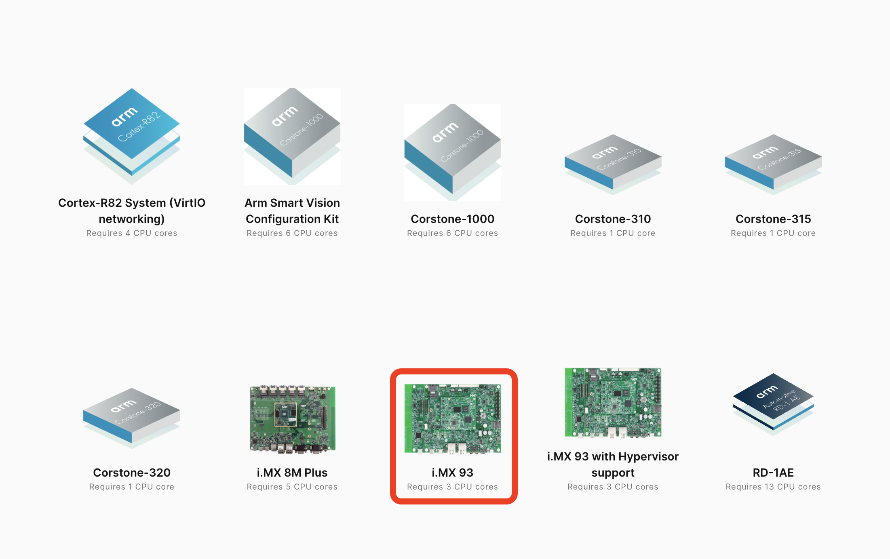
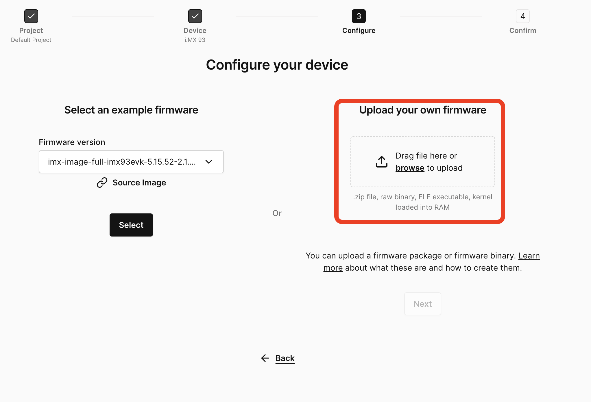

# Setting up Corellium Virtual device

1. You need to make an account at [Corellium](https://app.avh.corellium.com/login). If you are new to Corellium, you can sign up with Arm Account to activate a free trial to try out remoteproc runtime.
2. Create new device
   
3. Select Default Project
   
4. Select i.MX93 board
   
5. Use the image provided [here](https://github.com/Arm-Debug/remoteproc-runtime/releases/download/assets/image.zip) and upload it to the custom image section
   
6. You will have a functioning Virtual i.MX93 to try out Remoteproc runtime. You can go back to [USAGE.md's Containered Shim section](./USAGE.md#containerd-shim) or [Container Runtime section](./USAGE.md#container-runtime-️-wip) and try out the Remoteproc runtime.
